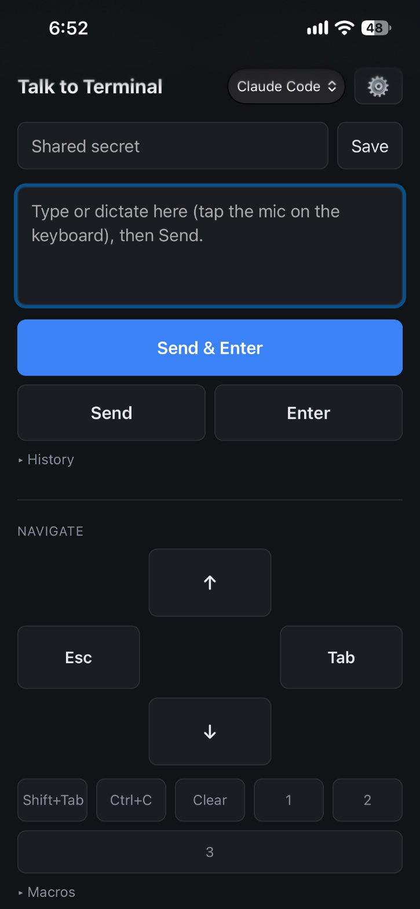
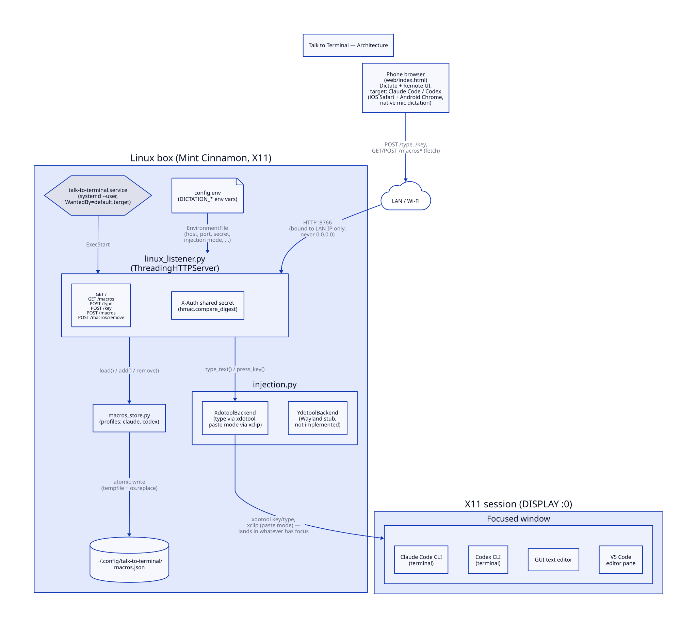

# Talk to Terminal

**Remote-control your dev box from your phone — voice input and real
keystroke control for Claude Code, Codex CLI, or anything else with
focus, from anywhere on your LAN.**

<p align="center">
  
</p>

## Why this exists

Claude Code and Codex CLI both now ship their own built-in voice
dictation (`/voice` and push-to-talk, respectively). So why does this
project exist?

Because built-in dictation solves a narrower problem than it looks like:

|                              | Built-in `/voice` (Claude Code / Codex)                                                                          | Talk to Terminal                                                                        |
|-------------------------------|--------------------------------------------------------------------------------------------------------------------|--------------------------------------------------------------------------------------------|
| **Where you have to be**      | Physically at the machine — mic and keyboard in hand                                                              | Anywhere on the same LAN — phone in another room, on the couch, wherever                   |
| **What it can do**            | Insert transcribed text into that CLI's own prompt                                                                | Insert text into *any* focused window, plus real keystroke control — Tab, Shift+Tab, Enter, Esc, Ctrl+C, numbered approval menus |
| **Which tools it works with** | Only the CLI it's built into                                                                                      | Claude Code, Codex CLI, a GUI text editor, VS Code — anything with OS focus                |
| **Auth / plan dependency**    | Claude Code needs a Claude.ai login (not API key, Bedrock, Vertex, or Foundry). Codex's voice is gated to Plus/Pro/Business/Edu/Enterprise plans | None — doesn't touch either vendor's auth or billing at all                                |
| **Dictation cost**            | Anthropic documents Claude Code's transcription as free. OpenAI has not published the same guarantee for Codex   | Always free — runs on your phone's own on-device dictation, nothing sent to either vendor to transcribe |
| **Which phone**               | N/A (not phone-based)                                                                                             | Any phone with a modern browser — iOS Safari or Android Chrome, both have native dictation on the keyboard mic |

In short: built-in voice dictation is great *while you're sitting at the
keyboard, talking to one specific CLI*. Talk to Terminal is for
everything else — you're away from the machine, you want to approve a
plan-mode prompt or hit Ctrl+C without walking over, you switch between
Claude Code and Codex sessions, or you just want one dictation path that
works the same no matter which tool, vendor, or phone platform you're
using that day.

## How it works

1. **On your phone** — open a browser page served by this project (no
   app install), and either dictate using your phone's own keyboard mic
   (iOS or Android) or use the on-screen navigation and macro controls.
2. **Over your LAN** — the page sends the text (or a keystroke command)
   to a small Python service on your Linux machine, authenticated with a
   shared secret.
3. **On your machine** — the service injects it as real keystrokes into
   whatever window currently has focus, via `xdotool`: a GUI editor, VS
   Code, or a terminal running Claude Code or Codex CLI.

No new phone app. No cloud dependency beyond your own LAN. No tokens
spent on either AI vendor for the dictation step, ever.



Source: [`docs/architecture.d2`](docs/architecture.d2), written in
[D2](https://d2lang.com). After editing it, re-render the image above
with `d2 docs/architecture.d2 docs/architecture.svg` (or run
`d2 --watch docs/architecture.d2` for a live preview while you work) —
the SVG is committed rather than generated on the fly, so it has to be
regenerated by hand and committed alongside any change to the source.

## Before you set this up: what the shared secret actually protects

> [!WARNING]
> Anyone who has your `DICTATION_SHARED_SECRET` can send keystrokes to
> whatever window is currently focused on your Linux machine — not just
> text, but Tab/Enter/Ctrl+C and anything a macro types. If a terminal
> happens to be focused, that means they can type and submit arbitrary
> shell commands. This is the same level of access as sitting at your
> keyboard, not a minor inconvenience if it leaks.

That's not a reason to avoid this project — it's the same trust model as
any other device you let onto your home Wi-Fi. It just means this one
secret deserves real care, the same as an SSH key would, not the
casual treatment you'd give a website password:

- **Generate it randomly** — `openssl rand -hex 32`, already the default
  in `config.env.example`. Don't use anything guessable.
- **Keep it on trusted networks only.** It travels as a plain HTTP
  header, not HTTPS — fine on a home LAN you control, but don't run this
  while connected to shared, public, or otherwise untrusted Wi-Fi, since
  anyone else on that network can see it in transit.
- **Remember where it's stored.** The browser page saves it in that
  browser's `localStorage` on every device you've used it from — treat
  each of those devices as holding a copy of your keyboard's keys.
- **Rotate it if you're ever unsure.** Change `DICTATION_SHARED_SECRET`
  in `config.env`, restart the service, and re-enter the new value on
  every device that uses this.
- **Never commit `config.env` to git.** It's never inside this checkout
  to begin with — setup puts it in `~/.config/talk-to-terminal/`,
  outside the repo entirely — so keep it there if you fork or restructure
  this, rather than moving it into the project directory.

## 1. Linux side setup

```bash
sudo apt install xdotool xclip   # xclip only needed for the paste fallback (section 4, Terminal reliability)
```

The service runs directly out of this checkout (`~/workspace/iphone_dict_capture/`)
— no separate copy step, so a `git pull` here and a service restart is all
an update takes. Keep the checkout where the systemd unit expects it
(`~/workspace/iphone_dict_capture/`), or edit `ExecStart` in
`talk-to-terminal.service` if you keep it elsewhere.

Create your config from the template — this holds the shared secret, so
it's kept out of the app directory and out of git:

```bash
mkdir -p ~/.config/talk-to-terminal
cp config.env.example ~/.config/talk-to-terminal/config.env
```

Edit `~/.config/talk-to-terminal/config.env`:

- `DICTATION_HOST` — this box's LAN IP (find it with `ip -4 addr show`,
  or `hostname -I`). Never `0.0.0.0` — the listener refuses to start with
  that value (see project_spec.md section 5).
- `DICTATION_SHARED_SECRET` — generate one with `openssl rand -hex 32`.

Install and start it as a **user** service (not system-wide) so it
inherits your graphical session's DISPLAY automatically:

```bash
mkdir -p ~/.config/systemd/user
cp talk-to-terminal.service ~/.config/systemd/user/
systemctl --user daemon-reload
systemctl --user enable --now talk-to-terminal.service
systemctl --user status talk-to-terminal.service
journalctl --user -u talk-to-terminal.service -f   # watch logs (never logs dictated text)
```

If xdotool silently does nothing, it's almost always a DISPLAY/XAUTHORITY
mismatch — see the "Troubleshooting" section below and the commented-out
lines in `talk-to-terminal.service`.

Quick manual test from the same machine:

```bash
curl -i -X POST http://localhost:8766/type \
  -H "X-Auth: <your secret>" \
  --data "hello from curl"
```

Click into a text editor first — the text should get typed there. A
request with a wrong/missing `X-Auth` should come back `401` and type
nothing:

```bash
curl -i -X POST http://localhost:8766/type -H "X-Auth: wrong" --data "nope"
```

## 2. Find your LAN address

```bash
ip -4 addr show    # or: hostname -I
```

Use the address on your actual LAN interface (e.g. `eno1`/`wlan0`), not
`docker0` or `127.0.0.1`. You'll open
`http://<that-ip>:8766/` from your phone's browser, as long as it's on
the same network — no port forwarding needed, but also no protection
beyond the shared secret once you're both on that network (see
project_spec.md section 5 — the secret is load-bearing here, not just
defense in depth).

## 3. Browser page (iOS and Android)

This is the primary, cross-platform way to use Talk to Terminal — works
the same on an iPhone or an Android phone, no app install, just a
browser tab.

Open `http://<lan-ip>:8766/` on your phone (or desktop) browser. On
first load you'll be asked for the shared secret — the same value as
`DICTATION_SHARED_SECRET` in `config.env`. It's saved in the browser's
`localStorage` so you only enter it once per device; note that anything
in `localStorage` is visible to anyone with devtools access to that
browser, which is an accepted trade-off consistent with the existing
threat model (anyone who has the secret can already `curl /type`
directly — the browser is just another such client). Use the gear icon
if you ever need to re-enter it (e.g. after rotating
`DICTATION_SHARED_SECRET`).

**Dictate**: a text box that POSTs to `/type`. Both iOS Safari's and
Android Chrome's on-screen keyboard mic button work in any focused text
field, so this is a real, native dictation path on either platform, not
just a paste box.

Choose **Claude Code** or **Codex** in the selector at the top. The choice is
saved only in that browser's local storage, so different phones can use a
different target. Dictation and Send are unchanged: both always POST text to
`/type` and type it into whichever window is focused.

**Remote controls**: buttons POST to the `/key` endpoint (a named
action, validated server-side against a fixed allowlist, mapped to
`xdotool key <combo>` — see `project_spec.md` section 3, "Remote mode")
and to a target-specific macro list (typed literal text + Enter).

- **Tab / Shift+Tab / Enter** (primary row) — common navigation and
  confirmation controls for either CLI.
- **Codex workflow** — when Codex is selected, `Shift+Tab` is promoted to a
  **Plan ↔ Default** button. **Permissions** types `/permissions` and submits
  it, because Codex CLI manages approval policy separately from its plan
  toggle. Claude Code retains the compact Shift+Tab button for cycling its
  permission modes.
- **Macros** (primary row, next to nav) — each target has its own editable
  list. Claude Code starts with `/model`, `/context`, `/cost`, `/vis`;
  Codex starts with `/model`, `/new`, `/resume`, `/status`. Expand
  "Macros" and tap "Edit" to reveal add/remove controls — off by default
  so the run buttons aren't one accidental tap away from deleting
  something. Edits are saved to `~/.config/talk-to-terminal/macros.json`
  immediately (and stay separate by target) — **no service restart
  needed** to pick them up, since the file is read fresh on every
  request. Clicking a macro types the literal text, then presses Enter
  (two separate calls under the hood, not a trick with a trailing
  newline — see `project_spec.md` for why).
- **Esc / Ctrl+C / 1 / 2 / 3** (secondary row, smaller) — occasional-use
  actions: Esc interrupts (double-Esc opens the rewind menu), Ctrl+C
  cancels the current task without exiting, and 1/2/3 pick options in
  numbered plan/permission menus (still confirmed with Enter).

Manual checks, same style as section 1's curl test:

```bash
curl -i -X POST http://localhost:8766/key -H "X-Auth: <your secret>" --data "tab"
curl -i -X POST http://localhost:8766/key -H "X-Auth: <your secret>" --data "bogus"   # 400, not in the allowlist
curl -i http://localhost:8766/macros -H "X-Auth: <your secret>"                        # seeded macro list
curl -i 'http://localhost:8766/macros?target=codex' -H "X-Auth: <your secret>"          # Codex macro list
```

## 4. Terminal reliability (read before relying on this for Claude Code or Codex)

`xdotool type` sends synthetic X11 key events. Some terminal emulators or
TUI apps — including a Claude Code or Codex CLI session — may drop or
reorder characters when text arrives in a fast burst. Work down this
list in `~/.config/talk-to-terminal/config.env` if you see drops:

1. `DICTATION_TYPE_DELAY_MS` — adds a per-character delay to `xdotool
   type` (try `20`–`50`).
2. `DICTATION_CHUNK_SIZE` / `DICTATION_CHUNK_PAUSE_MS` — splits each line
   into smaller bursts with a pause between them.
3. `DICTATION_INJECTION_MODE=paste` — last resort for terminal targets:
   instead of simulating keypresses, the whole utterance is put on the
   clipboard (`xclip`) and pasted with one keystroke
   (`DICTATION_PASTE_KEY_COMBO`, default `ctrl+shift+v` — the usual
   terminal paste binding; GUI apps typically want `ctrl+v` instead, so
   this mode is meant for terminal-focused use, not as the global
   default).

Restart the service after editing the config
(`systemctl --user restart talk-to-terminal.service`).

## 5. Troubleshooting

**xdotool does nothing / errors about no display:**
The `systemd --user` service doesn't always inherit `DISPLAY`/`XAUTHORITY`
from the graphical session depending on the display manager. Check what
the service actually sees:

```bash
systemctl --user show-environment | grep -E 'DISPLAY|XAUTHORITY'
```

Compare against an active desktop terminal:

```bash
echo $DISPLAY $XAUTHORITY
```

If they differ (or the service's are empty), uncomment the `Environment=`
lines in `talk-to-terminal.service`, set them to the values from `echo`
above, then `systemctl --user daemon-reload && systemctl --user restart
talk-to-terminal.service`.

**Confirming X11 vs Wayland:**

```bash
echo $XDG_SESSION_TYPE
```

If this says `wayland`, `xdotool` won't work — set
`DICTATION_BACKEND=ydotool` and implement `YdotoolBackend.type_text()` in
`injection.py` first (it's currently a stub that raises
`NotImplementedError`; requires installing `ydotool` + `ydotoold` and
adding the service user to the `input` group).

**Service doesn't survive a reboot or logout:**
The unit is `WantedBy=default.target`, not `graphical-session.target` —
on some desktop environments (Cinnamon among them) the latter is never
reliably activated by the session, so units that depend only on it can
silently never start. `default.target` fires reliably on every login,
and `DISPLAY`/`XAUTHORITY` are already present in the user systemd
instance's environment regardless of which target triggered the start.
If the service still isn't running after a reboot, confirm the unit is
enabled (`systemctl --user is-enabled talk-to-terminal.service`) and
check `systemctl --user list-units --type=service --all` — remember
these are **user** services (`systemctl --user ...`), not system
services, so they won't show up in plain `systemctl` output at all.

## Notes

- LAN binding + the shared secret means anyone else on your network could
  reach the endpoint, but only someone with the secret can get it to type
  anything.
- Works identically across GUI apps because it's simulating real keyboard
  input at the X11 level — nothing app-specific to configure per tool.
  Terminal targets may need the reliability knobs in section 5.
- No dictated text is ever logged — only line counts, auth failures, and
  injection errors go to the journal.
- If you switch this box to Wayland later, see "Confirming X11 vs
  Wayland" above — the HTTP layer doesn't change either way.
